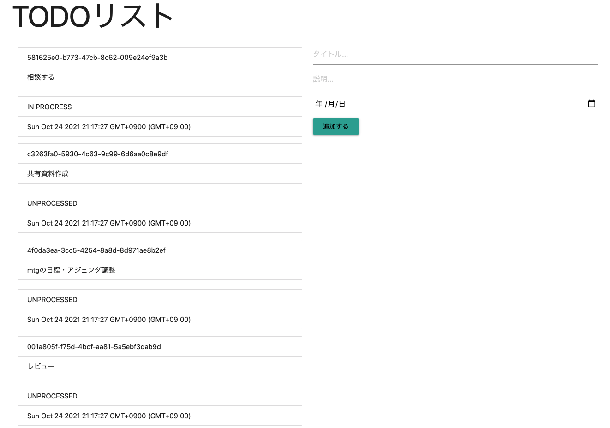
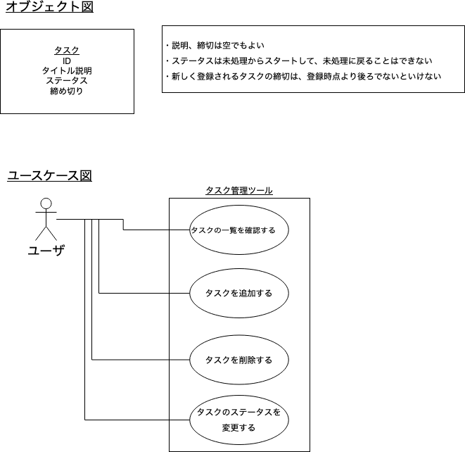

# nest-todo
NestJSを使ったTODOアプリの実装

## 起動方法
```bash
$npm run start
```

起動時の画面イメージ




## ドメインの知識、表現
- このアプリケーションはドメイン駆動設計の概念を使ったモデリング、実装を採用している。
- タスク管理ツールのドメイン知識。足りないユースケースはのちほど。



## レイヤリング
アプリケーションはTODO(タスク)を中心に構築される。

```
src/
  tasks/
    infrastructure/ ... 永続化層の実装レイヤ。マッパーインターフェース、実装など。
    model/ ... タスクモデルなどドメインオブジェクトの表現。
    repository/ ... リポジトリ。集約およびオブジェクトの整合性を維持する。
    type/
    tasks.controller.ts ... コントローラのエンドポイント
    tasks.module.ts ... 依存するオブジェクトの定義
```

## マッパー実装の入れ替え
マッパーの実装にはインメモリのオブジェクトとMongoDBによる永続化の実装が提供される。デフォルトはインメモリのオブジェクト。

マッパーの実装を入れ替える際は `TasksMapper` のuseClassを以下のように入れ替える。

```ts
@Module({
  controllers: [TasksController],
  providers: [
    {
      provide: 'TasksRepository',
      useClass: DefaultTasksReposiory,
    },
    {
      provide: 'TasksMapper',
      useClass: LocalMongoDbTasksMapper,
    },
  ],
})
export class TasksModule {}
```
また、この際必要になるローカルのMongoDBは `docker-compose up -d` で起動することができる。

